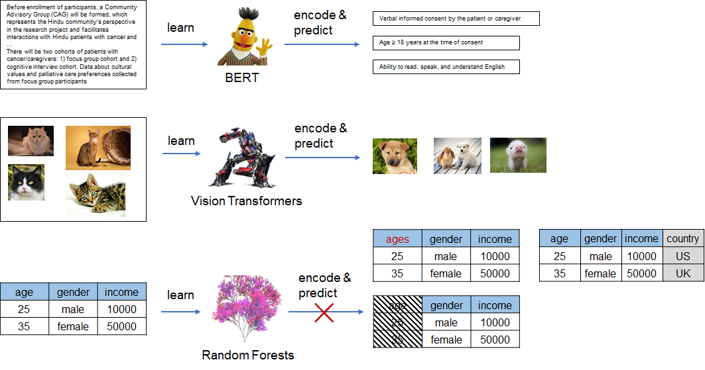
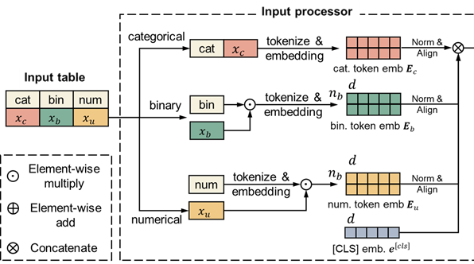
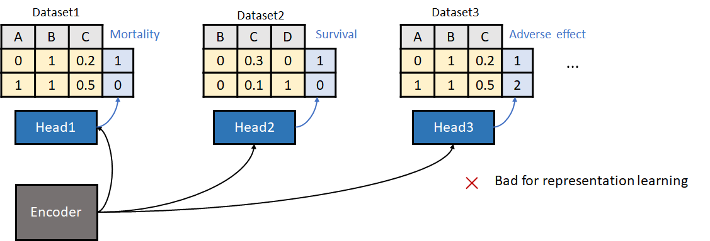
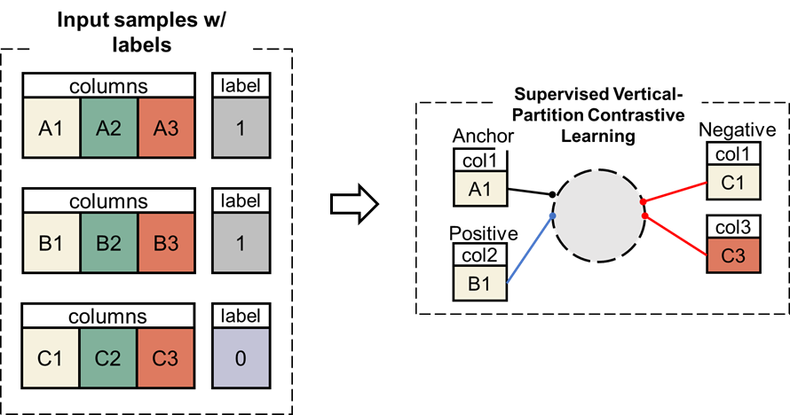
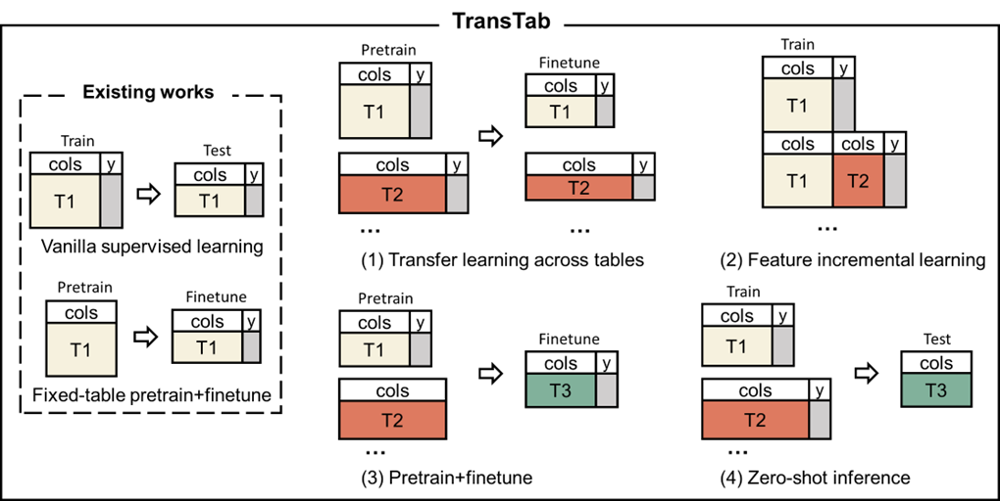
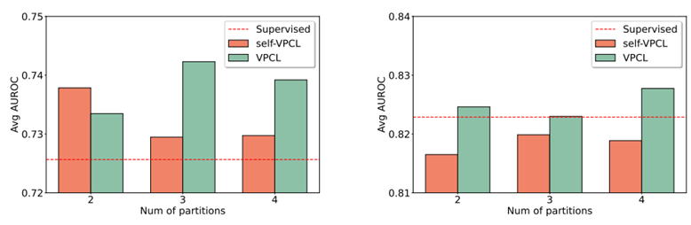
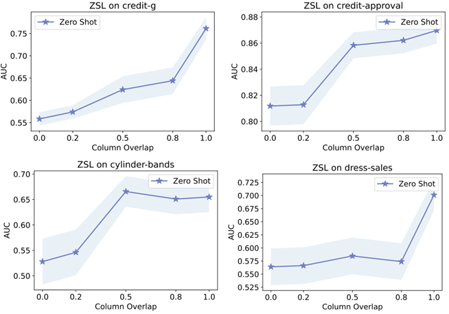

# NeurIPS'22 | How to perform transfer learning and zero-shot learning on tabular data?

> This is our paper accepted by NeurIPS'22 with ratings 7/7/7, where we work on pretraining, transfer learning, and zero-shot learning on the tabular prediction task. The following are the links for this article and the codes.

Paper: [TransTab: Learning Transferable Tabular Transformers Across Tables](https://arxiv.org/pdf/2205.09328.pdf)

Code: [TransTab-github](https://github.com/RyanWangZf/transtab)

Doc: [Transtab-doc](https://transtab.readthedocs.io/en/latest/)

---


## Tabular learning was not flexible

In this article, we refer the term *tabular learning* to the predictive task on the tabular data. For instance, we might know Kaggle competitions, where a lot of competitions are based on tabular data, e.g., house price prediction, credit fault detection, CTR prediction, etc. Basically, this type of task is on predicting the target label through a couple of features, just like in the following table

| index | feature A | feature B | feature C | label |
| ----- | --------- | --------- | --------- | ----- |
| 0     | $x_1$     | $x_2$     | $x_3$     | $y$   |

one might take a linear regression to solve this problem as
$$
y = ax_1 + b x_2 + c x_3 +d.
$$
Compared with images and texts, tables are usually more frequently used in industrial applications. As we all know, recently there emerged the *pretrain+finetune* paradigm in the deep learning area, especially flourished in computer vision (CV) and natural language processing (NLP).


<figure>

<figcaption align = "center"> 
<b>Figure 1:</b> CV or NLP models usually share the same basic input unit, i.e., pixel for images and word/token for texts. However, tabular models only accept a fixed-structure table: the train and test tables should *always* have equal column sets, which prevents us from transfer learning or zero-shot learning on tabular data.
</figcaption>
</figure>


In CV & NLP, pretrained models like BERT, and ViT have become the strong baseline for almost all tasks. By contrast, in the tabular learning domain, we usually encounter the case "xgboost is all you need". GBDT models can achieve competent performances with less effort on data preprocessing and hyperparameter tuning than deep learning-based methods. In this circumstance, a lot of researchers have started to think about how we outperform GBDT using deep learning, especially leveraging the power of deep learning on big multi-sourced data.


## Recent efforts on transfer learning for tabular learning

Of course, there have been some efforts on transfer learning for deep learning-based tabular learning. For example, VIME [[1]](#1), SCARF [[2]](#2), and SubTab [[3]](#3) all employ self-supervision for tabular learning. The common self-supervision can be categorized as *generative* and *discriminative* learning. For the first venue, we mask several cells in the table and ask the model to recover the missing values; for the second, we create positive samples by deleting or replacing cells.

Nonetheless, they hardly apply to real application cases: all apply to fixed-structure tables. We do not have a large table without labels, instead, we often have multiple heterogenous labeled labels. The core challenge is how to leverage as much labeled data as possible and get rid of heavy data preprocessing and missing value imputation.

The nature of only receiving fixed-structure tables causes all existing tabular methods to be incapable of dealing with pretraining on multi-sourced tables. Once there is a minor change in the table's structure, e.g., a column named *age* changed to *ages*, the pretrained model becomes useless. And we need to roll back to the process of *data processing* $\to$ *feature engineering* $\to$ *model training*, which is costly in terms of time and money.

Therefore, we ask, if it is possible to propose a tabular model that encodes **arbitrary** input tables needless of any adaptions?


### Tabular learning is flexible

In fact, if we look back on the tabular data, we shall identify the column names are rich in semantics, which were long neglected by previous methods. 

| index | gender | age  | is_citizen |
| ----- | ------ | ---- | ---------- |
| 0     | male   | 25   | 0          |

In this example, we include three common types of features: *categorical*, *numerical*, and *binary*.

We argue that interpreting features considering column names is necessary. We know *25* under the column *age* means 25 years old instead of 25 km or 25 kg. We know *0* under the column *is_citizen* means the person is not a citizen instead of is not anything else. Previous methods drop column names and enforce the model to learn semantics from the raw features for decision-making, which is easy to implement but not transferable.

On the contrary, we ask why not just explicitly include the column names in the modeling. Surprisingly, we do not find any prior arts doing that in tabular learning.

Formally, we process three types of features through

- For categorical: we concatenate column names and features, i.e., *gender is male*.
- For numerical, we tokenize and embed column names, then multiply the column embeddings with the feature value.
- For bool: we tokenize and embed column names, they decide if pass this embedding to the encoder based on feature. If 0, then we drop this embedding.


<figure>

<figcaption align = "center"> 
<b>Figure 2:</b> The input feature processing module of *TransTab*.
</figcaption>
</figure>


With this processing module, we can linearize, tokenize, and embed any tabular data, which serves as the inputs for the encoder and the predictor.


## Pretraining for TransTab

Thanks to its flexibility, *TransTab* is capable of learning across multiple heterogeneous tables. However, it is nontrivial to design an appropriate pretraining algorithm for it.


<figure>

<figcaption align = "center"> 
<b>Figure 3:</b> Learning across tables using naive supervised learning is harmful for representation learning.
</figcaption>
</figure>


The most straightforward way is illustrated as above: we train a shared backbone encoder plus task-specific  classifiers across tabular datasets. Nevertheless, we soon find this paradigm is suboptimal. The flaw comes from the heterogeneity of the target labels: two datasets might have opposite definition of labels.

Accounting for this issue, we propose a novel **supervised contrastive learning** approach, namely **vertical partition contrastive learning (VPCL)** in this paper.


<figure>

<figcaption align = "center"> 
<b>Figure 4:</b> The proposed vertical partition contrastive learning (VPCL) approach for pretraining TransTab in our paper.
</figcaption>
</figure>

Its principle is:

- We split each raw (sample) into several partitions vertically, each partition is a sample for contrastive learning.
- The partition comes from the same-label raw are positive, and vice versa.

VPCL has the following merits:

- It significantly expand the number of pairs for contrastive learning.
- It is much more efficient and robust because it does not add additional task-specific classifiers.


## Which new tasks that TransTab can solve?

Thanks to the flexibility of TransTab, it now handles many new tasks.


<figure>

<figcaption align = "center"> 
<b>Figure 5:</b> The new tasks that are amenable to TransTab.
</figcaption>
</figure>


- Learning across multiple labeled datasets (share the same label) based on supervised learning, and finetuned on each specific dataset.
- Learning from an incremental set of features and data, which usually originates from the updated measurements over time.
- Pretrained on multiple labeled/unlabeled datasets (can have distinct labels) based on supervised VPCL, and finetuned on each dataset.
- Learning from multiple labeled datasets (share the same label) based on supervised learning, and making predictions for brand new data without any further parameter updates.


## Some experiment results

For the complete experiment results, please refer to [our paper](https://arxiv.org/pdf/2205.09328.pdf). Here we tell two interesting findings.


### Pretraining

<figure>

<figcaption align = "center"> 
<b>Figure 6:</b> Experiment results of the pretraining+finetuning performances of TransTab.
</figcaption>
</figure>

The above figure illustrates the average performance (AUC) on multiple datasets. Left: on clinical  trial patient outcome prediction datasets. Right: on many open datasets. The red dotted line indicates the naive supervised learning performance. X-axis is the number of partitions made for VPCL.

We find:

- Supervised VPCL generally improves predictive performances.
- It is not an universally optimal number of partitions for VPCL.
- Compared with open datasets, the pretraining on the left introduces much more improvements. That implies that it is still crucial to transfer knowledge from datasets coming from the similar domain. While the open datasets are very heterogeneous.


### Zero-shot prediction


<figure>

<figcaption align = "center"> 
<b>Figure 7:</b> Experiment results of the zero-shot learning performances of TransTab.
</figcaption>
</figure>

The above figures demonstrate the zero-shot prediction performances of TransTab. We split one dataset into two parts and vary the overlap ratio of their column sets: from 0% to 100%. We find:

- TransTab can even make reasonable predictions when there is **no column overlapping** between the train and test data, which is really amazing.
- When the overlap ratio increases, we witness better performances, which is reasonable.


## Use TransTab based on our package

We opensourced our package on [github](https://github.com/RyanWangZf/transtab) with the [documentations](https://transtab.readthedocs.io/en/latest/). It can be downloaded through

```shell
pip install git+https://github.com/RyanWangZf/transtab.git
```


And it is rather easy to use it in tabular prediction tasks on multiple distinct tables:

```python
import transtab

# load multiple datasets by passing a list of data names
allset, trainset, valset, testset, cat_cols, num_cols, bin_cols \
    = transtab.load_data(['credit-g','credit-approval'])

# build transtab classifier model
model = transtab.build_classifier(cat_cols, num_cols, bin_cols)

# specify training arguments, take validation loss for early stopping
training_arguments = {
    'num_epoch':5,
    'eval_metric':'val_loss',
    'eval_less_is_better':True,
    'output_dir':'./checkpoint'
    }

# start training
transtab.train(model, trainset, valset[0], **training_arguments)
```


For pretraining based on VPCL, we have

```python
import transtab

# load multiple datasets by passing a list of data names
allset, trainset, valset, testset, cat_cols, num_cols, bin_cols \
    = transtab.load_data(['credit-g','credit-approval'])

# build contrastive learner, set supervised=True for supervised VPCL
model, collate_fn = transtab.build_contrastive_learner(
    cat_cols, num_cols, bin_cols,
    supervised=True, # if take supervised CL
    num_partition=4, # num of column partitions for pos/neg sampling
    overlap_ratio=0.5, # specify the overlap ratio of column partitions during the CL
)

# start contrastive pretraining training
training_arguments = {
    'num_epoch':50,
    'batch_size':64,
    'lr':1e-4,
    'eval_metric':'val_loss',
    'eval_less_is_better':True,
    'output_dir':'./checkpoint' # save the pretrained model
    }

# pass the collate function to the train function
transtab.train(model, trainset, valset, collate_fn=collate_fn, **training_arguments)
```

And after the pretraining completes, we can build a new classifier based on the pretrained model:

```python
# load the pretrained model and finetune on a target dataset
allset, trainset, valset, testset, cat_cols, num_cols, bin_cols \
    = transtab.load_data('credit-approval')

# build transtab classifier model, and load from the pretrained dir
model = transtab.build_classifier(checkpoint='./checkpoint')

# update model's categorical/numerical/binary column dict
model.update({'cat':cat_cols,'num':num_cols,'bin':bin_cols})
```

It is easy 😎 !


## Conclusion

Duplicating the success of deep learning in CV & NLP to tabular learning domain still requires rethinking the basic elements. In CV, we have pixel; in NLP, we have token/word. In this paper, we propose a simple yet effective algorithm to model tabular data. Our method explores using NLP techniques for enhancing tabular learning, with flexibility to handle arbitrary input tables. We hope it appeals to more attention in deep learning for tabular learning.


## References
<a id="1"> [1] </a> Jinsung Yoon, Yao Zhang, James Jordon, and Mihaela van der Schaar. VIME: Extending the success of self-and semi-supervised learning to tabular domain. Advances in Neural Information Processing Systems, 33:11033–11043, 2020.

<a id="2"> [2] </a> Dara Bahri, Heinrich Jiang, Yi Tay, and Donald Metzler. SCARF: Self-supervised contrastive learning using random feature corruption. In International Conference on Learning Representations, 2022.

<a id="3"> [3] </a> Talip Ucar, Ehsan Hajiramezanali, and Lindsay Edwards. SubTab: Subsetting features of tabular data for self-supervised representation learning. Advances in Neural Information Processing Systems, 34, 2021.
