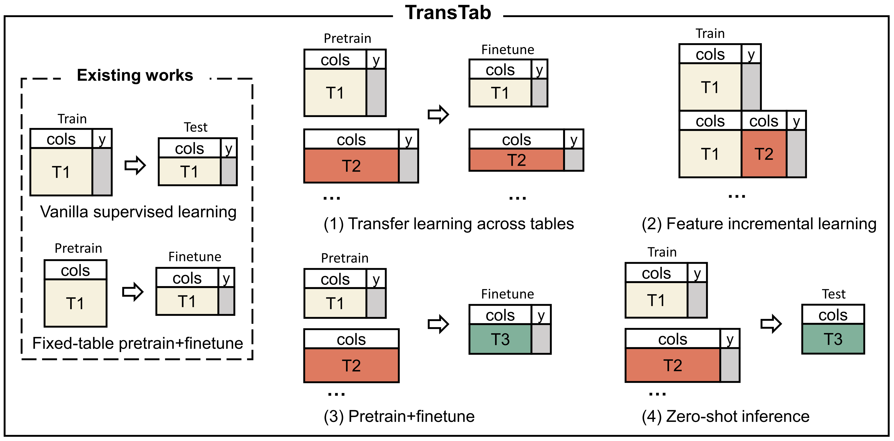

Welcome to transtab documentation!
==================================

`transtab` is an easy-to-use **Python package** for flexible tabular prediction framework. **Tabular data** dominates the applications of machine learning in research & development, including healthcare, finance, advertising, engineering, etc.

`transtab` is featured for the following scenarios of tabular predictions:

* **Supervised learning**: the vanilla train and predict on tables with the identical columns.
* **Transfer learning**: given multiple labeled tables partially share columns, we enhance models for each of those tables by leveraging other tables.
* **Incremental learning**: as a table incrementally grows with more columns, we update the existing model to handle the new table with more columns.
* **Table Pretraining**: we pretrain models on many tables with distinct columns and identifiers for the target tabular prediction task.
* **Zero-shot inference**: we build a model for an unseen table that only has partial overlaps with training tables.

    The demonstration of ML modeling on different tabular data settings.
    Previous tabular methods only do vanilla supervised training or pretraining on the same table due to they only accept
    **fixed-column tables**. By contrast, \method covers more new tasks (1) to (4) as it accepts **variable-column** tables.

The basic usage of `transtab` can be done in a couple of lines:

.. code-block:: python

    import transtab

    # load dataset by specifying dataset name
    allset, trainset, valset, testset, cat_cols, num_cols, bin_cols \
        = transtab.load_data('credit-g')

    # build classifier
    model = transtab.build_classifier(cat_cols, num_cols, bin_cols)

    # start training
    transtab.train(model, trainset, valset, **training_arguments)

    # make predictions, df_x is a pd.DataFrame with shape (n, d)
    # return the predictions ypred with shape (n, 1) if binary classification;
    # (n, n_class) if multiclass classification.
    ypred = transtab.predict(model, df_x)

It's easy, isn't it?

Let's start the journey from the `installation <https://transtab.readthedocs.io/en/latest/install.html>`_ and the `first demo on supervised tabular learning <https://transtab.readthedocs.io/en/latest/fast_train.html>`_ !

We also provide the examples on `tabular transfer learning <https://transtab.readthedocs.io/en/latest/example_transfer.html>`_ and `tabular pretraining <https://transtab.readthedocs.io/en/latest/example_pretrain.html>`_ for the quick start.

----

**Citing transtab**:

If you use `transtab` in a scientific publication, we would appreciate citations to the following paper::

    @article{wang2022transtab,
        author = {Wang, Zifeng and Sun, Jimeng},
        title = {TransTab: Learning Transferable Tabular Transformers Across Tables},
        journal={arXiv preprint arXiv:2205.09328},
        year = {2022},
    }

.. toctree::
   :maxdepth: 2
   :hidden:
   :caption: Getting Started

   install
   fast_train
   example_transfer
   example_pretrain
   example_encode
   data_preparation

.. toctree::
    :maxdepth: 2
    :hidden:
    :caption: Documentation

    main_func
    models

.. toctree::
    :maxdepth: 2
    :hidden:
    :caption: Additional Information

    about
